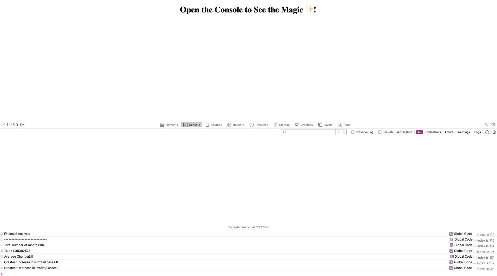

# Console-Finances

## Description

This code has been created to analyze the financial records for a company.

With this code a dataset containing names of months and their financial peformance can be used to calculate:

- The total number of months in the data set.
- The net total amount of Profit/Losses over the entire period.
- The average of the changes in Profit/Losses over the entire period.
- The greatest increase in profits (date and amount) over the entire period.
- The greatest decrease in losses (date and amount) over the entire period.

## Installation

Follow the link below to view the webpage:

https://ekh-b.github.io/Console-Finances/

## Usage

1) Right click nd select 'Inspect'.
2) Then click on the console tab to view the javascript code.

   

## Credits

Wepbages/ Tutorials:
https://www.digitalocean.com/community/tutorials/how-to-work-with-strings-in-javascript

## License

Please refer to the LICENSE in the repo.

